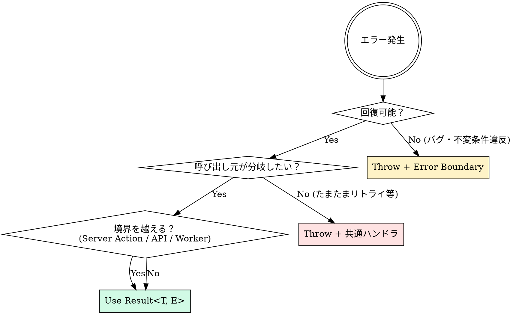

# エラーハンドリングのベストプラクティス

> **層責任**: エラー処理は 3 レイヤーで分担する。このファイルは **UI 層**（Error Boundary、`error.tsx`、Result 型、回復 UI）を扱う。
> - **HTTP / API 層**（4xx・5xx 分類、リトライ判定、認証エラー処理）→ [`api-client/error-handling.md`](../api-client/error-handling.md)
> - **観測 / 集計層**（Sentry でのキャプチャ、フィルタ、ノイズ削減、PII スクラブ）→ [`observability/error-tracking.md`](../observability/error-tracking.md)
>
> 流れは `HTTP エラー検知 → 分類 → 回復 UI / Error Boundary → ログ・Sentry 通知` の方向。

## ルール

### 1. Next.js の `error.tsx` と `not-found.tsx` でエラー境界を設定する

ルートセグメントに `error.tsx` と `not-found.tsx` を配置し、
エラー発生時のUIをルート単位で制御する。

**根拠**:
- `error.tsx` は ErrorBoundary を自動的にラップし、サーバーコンポーネントのエラーをキャッチする
- ルート単位でエラーを封じ込めることで、一部のエラーがページ全体を壊さない
- `notFound()` 関数と組み合わせて、存在しないリソースへの適切なレスポンスが可能

**コード例**:
```tsx
// app/error.tsx（ルートレベルのエラーキャッチ）
'use client';

import { useEffect } from 'react';

export default function GlobalError({
  error,
  reset,
}: {
  error: Error & { digest?: string };
  reset: () => void;
}) {
  useEffect(() => {
    reportError(error);
  }, [error]);

  return (
    <div role="alert">
      <h2>問題が発生しました</h2>
      <p>しばらく経ってから再試行してください。</p>
      <button onClick={reset}>再試行</button>
    </div>
  );
}

// app/dashboard/error.tsx
'use client';

export default function DashboardError({
  error,
  reset,
}: {
  error: Error;
  reset: () => void;
}) {
  return (
    <div>
      <h2>ダッシュボードの読み込みに失敗しました</h2>
      <button onClick={reset}>再読み込み</button>
    </div>
  );
}

// app/users/[id]/page.tsx
import { notFound } from 'next/navigation';

export default async function UserPage({ params }: { params: { id: string } }) {
  const user = await db.user.findUnique({ where: { id: params.id } });
  if (!user) notFound();
  return <UserProfile user={user} />;
}

// app/users/[id]/not-found.tsx
export default function UserNotFound() {
  return <div>ユーザーが見つかりません</div>;
}
```

**出典**:
- [Next.js Docs: Error Handling](https://nextjs.org/docs/app/building-your-application/routing/error-handling) (Next.js公式)

**バージョン**: Next.js 13+
**確信度**: 高
**最終更新**: 2026-05-05

---

### 2. Result 型パターンでエラーを値として扱う

例外のスロー（throw/catch）の代わりに Result 型でエラーを戻り値として表現する。
Server Actions や API 呼び出しで特に有効。

**根拠**:
- 例外は型システムに現れないため、エラーケースの処理が見えなくなる
- Result 型にすることでエラーケースを TypeScript が強制的に処理させられる
- `try/catch` ブロックの乱用を防ぎ、エラー処理の一貫性が保てる

**コード例**:
```ts
// shared/types/result.ts
export type Result<T, E = Error> =
  | { ok: true; value: T }
  | { ok: false; error: E };

export function ok<T>(value: T): Result<T, never> {
  return { ok: true, value };
}

export function err<E>(error: E): Result<never, E> {
  return { ok: false, error };
}

// features/auth/actions/login.ts
'use server';

import { ok, err, Result } from '@/shared/types/result';

type LoginError =
  | { type: 'invalid_credentials' }
  | { type: 'account_locked'; until: Date }
  | { type: 'network_error'; message: string };

export async function login(
  email: string,
  password: string
): Promise<Result<{ userId: string }, LoginError>> {
  try {
    const user = await db.user.findUnique({ where: { email } });

    if (!user || !verifyPassword(password, user.passwordHash)) {
      return err({ type: 'invalid_credentials' });
    }

    if (user.lockedUntil && user.lockedUntil > new Date()) {
      return err({ type: 'account_locked', until: user.lockedUntil });
    }

    return ok({ userId: user.id });
  } catch (e) {
    return err({ type: 'network_error', message: String(e) });
  }
}

// 呼び出し側
const result = await login(email, password);
if (!result.ok) {
  switch (result.error.type) {
    case 'invalid_credentials':
      showError('メールアドレスまたはパスワードが間違っています');
      break;
    case 'account_locked':
      showError(`アカウントは ${result.error.until.toLocaleString()} までロックされています`);
      break;
    case 'network_error':
      showError('通信エラーが発生しました');
      break;
  }
} else {
  redirectToDashboard(result.value.userId);
}
```

**Throw / Result / Promise.reject の判断フロー**:

3 つのエラー伝達方法は排他ではなく、**境界ごとに使い分ける**。判断の核心は「呼び出し元が回復可能か」と「エラーが型システムに表れる必要があるか」。



**判断マトリクス**:

| シチュエーション | 手段 | 理由 |
|---|---|---|
| Server Action / API レスポンス | **Result 型** | 呼び出し元が UI 分岐したい・型で網羅性確認 |
| ユーザー入力のバリデーション失敗 | **Result 型**（zod の `safeParse`） | 全エラーを集約してフォームに表示 |
| 検索結果が見つからない（404 相当の業務ロジック） | **Result 型** または `null`/`Option` | 「失敗」ではなく「正常な結果の 1 つ」 |
| 認証・認可失敗 | **Result 型** | UI で異なる扱いが必要（ログインモーダル等） |
| ネットワーク・DB 接続失敗 | **Throw** → グローバルハンドラ | 局所で扱えず、全体で対処 |
| プログラミングエラー（assertion 失敗・型保証違反） | **Throw** | バグ。クラッシュさせて Sentry で観測 |
| サードパーティ SDK の例外伝播 | **Throw** → Result 変換層 | 境界で `tryCatch` して Result 化 |
| 競合状態（race condition） | **Throw** + Error Boundary | レンダリング途中の予期せぬ状態。Suspense 再試行 |

**「常に Result 型」が破綻するケース**:

```ts
// Bad: 深い呼び出しチェーンで全関数が Result を返す → ノイズが多い
function deeplyNested(): Result<Data, AllErrors> {
  const a = stepA();
  if (!a.ok) return err(a.error);
  const b = stepB(a.value);
  if (!b.ok) return err(b.error);
  const c = stepC(b.value);
  if (!c.ok) return err(c.error);
  return c;
}

// Good: 境界では Result、内部では throw して境界で catch する
async function performTransaction(input: Input): Promise<Result<Output, TxError>> {
  try {
    const validated = validate(input);       // throw on validation failure
    const fetched = await fetchData(validated);  // throw on network error
    const processed = process(fetched);      // throw on logic error
    return ok(processed);
  } catch (e) {
    return err(classifyError(e));            // 境界で Result に変換
  }
}
```

**Promise.reject はいつ使うか**:

`Promise.reject` は本質的には async コンテキストでの `throw` と同等。明示的に使う場面は限られる:

- TanStack Query の `queryFn` が「リトライさせたい」エラーを返す時（Query は throw を期待する）
- React の `use()` フックが Promise を解決する文脈（reject → ErrorBoundary に伝播）
- 既存の Promise ベース API（fetch、IndexedDB 等）との互換性

```ts
// Good: TanStack Query が throw されたエラーを必要とする
useQuery({
  queryKey: ['user', id],
  queryFn: async () => {
    const result = await loginAction(); // Result 型を返す内部
    if (!result.ok) {
      throw new Error(result.error.message); // Query 用に throw に変換
    }
    return result.value;
  },
});
```

**ライブラリ選定（neverthrow / fp-ts / Effect）**:

- **手書きの Result 型**（推奨デフォルト）: 上記コード例の形。学習コストゼロ、依存追加なし
- **neverthrow**: `Result<T, E>` + `.map()` / `.andThen()` チェーン。関数型に親しめるチーム向け
- **fp-ts**: Either / TaskEither など本格関数型。チームに既存知識がなければ過剰
- **Effect**: エラー・依存・副作用を統合した次世代型。新規プロジェクトでチーム合意があれば

選定原則: **言語標準の機能で書ける範囲なら自前で書く**。チームのスキルセットと相談。

**出典**:
- [TypeScript Docs: Discriminated Unions](https://www.typescriptlang.org/docs/handbook/2/narrowing.html#discriminated-unions) (TypeScript公式)
- [Joel Spolsky: Exceptions](https://www.joelonsoftware.com/2003/10/13/13/) (Joel on Software, 2003)
- [neverthrow](https://github.com/supermacro/neverthrow) (supermacro)
- [Effect documentation](https://effect.website/) (Effect TS)

**バージョン**: TypeScript 5+
**確信度**: 高
**最終更新**: 2026-05-05 / 補強 2026-05-16

---

### 3. エラー境界とローディング状態を Suspense で統合管理する

React の ErrorBoundary と Suspense を組み合わせて、
ローディング・エラー・成功の状態を宣言的に管理する。

**根拠**:
- `loading.tsx` / `error.tsx` が ErrorBoundary と Suspense を自動的に設定する
- ローディング・エラー状態の管理ロジックをコンポーネントから分離できる
- React 19 の `use()` API と組み合わせることでより簡潔に書ける

**コード例**:
```tsx
// app/dashboard/loading.tsx
export default function DashboardLoading() {
  return (
    <div>
      <div className="h-8 w-48 animate-pulse rounded bg-gray-200" />
      <div className="mt-4 grid grid-cols-3 gap-4">
        {Array.from({ length: 3 }).map((_, i) => (
          <div key={i} className="h-32 animate-pulse rounded bg-gray-200" />
        ))}
      </div>
    </div>
  );
}

// app/dashboard/page.tsx
import { Suspense } from 'react';
import { ErrorBoundary } from 'react-error-boundary';

export default function DashboardPage() {
  return (
    <div>
      <h1>ダッシュボード</h1>

      <ErrorBoundary fallback={<StatsError />}>
        <Suspense fallback={<StatsSkeleton />}>
          <StatsPanel />
        </Suspense>
      </ErrorBoundary>

      <ErrorBoundary fallback={<FeedError />}>
        <Suspense fallback={<FeedSkeleton />}>
          <ActivityFeed />
        </Suspense>
      </ErrorBoundary>
    </div>
  );
}
```

**出典**:
- [Next.js Docs: Error Handling with Suspense](https://nextjs.org/docs/app/building-your-application/routing/error-handling) (Next.js公式)
- [React Docs: Suspense](https://react.dev/reference/react/Suspense) (React公式)

**バージョン**: Next.js 13+, React 18+
**確信度**: 高
**最終更新**: 2026-05-05

---

### 4. Error Boundary にフォールバック UI とリカバリー手段を必ず設ける

クライアントコンポーネントのランタイムエラーを `react-error-boundary` でキャッチし、
ユーザーが操作を継続できるフォールバック UI（再試行ボタン・ホームへの導線）を提供する。
エラーの種類に応じて「再試行で回復できるか」「ページリロードが必要か」を区別して設計する。

**根拠**:
- React の Error Boundary は render 中の例外のみキャッチし、イベントハンドラ内の例外はキャッチしない（別途処理が必要）
- フォールバックなしでは画面が空白になりユーザー体験を著しく損なう
- `react-error-boundary` の `onError` コールバックで Sentry 等への報告を一元化できる

**コード例**:
```tsx
// shared/components/AppErrorBoundary.tsx
import { ErrorBoundary, FallbackProps } from 'react-error-boundary';
import * as Sentry from '@sentry/nextjs';

function ErrorFallback({ error, resetErrorBoundary }: FallbackProps) {
  const isNetworkError = error.message.includes('fetch');

  return (
    <div role="alert" className="rounded border border-red-200 bg-red-50 p-4">
      <h2 className="font-semibold text-red-800">エラーが発生しました</h2>
      <p className="mt-1 text-sm text-red-600">
        {isNetworkError
          ? 'ネットワーク接続を確認して再試行してください。'
          : '予期しないエラーが発生しました。'}
      </p>
      <div className="mt-3 flex gap-2">
        <button
          onClick={resetErrorBoundary}
          className="rounded bg-red-600 px-3 py-1.5 text-sm text-white hover:bg-red-700"
        >
          再試行
        </button>
        <a href="/" className="rounded border px-3 py-1.5 text-sm hover:bg-gray-50">
          ホームに戻る
        </a>
      </div>
    </div>
  );
}

export function AppErrorBoundary({ children }: { children: React.ReactNode }) {
  return (
    <ErrorBoundary
      FallbackComponent={ErrorFallback}
      onError={(error, info) => {
        Sentry.captureException(error, {
          extra: { componentStack: info.componentStack },
        });
      }}
      onReset={() => {
        // 必要に応じてキャッシュや状態をリセット
      }}
    >
      {children}
    </ErrorBoundary>
  );
}

// Bad: フォールバックなし
<ErrorBoundary>
  <RiskyComponent />
</ErrorBoundary>
// → エラー時に空白になる
```

**出典**:
- [react-error-boundary](https://github.com/bvaughn/react-error-boundary) (Brian Vaughn / GitHub)
- [React Docs: Error Boundaries](https://react.dev/reference/react/Component#catching-rendering-errors-with-an-error-boundary) (React公式)

**バージョン**: react-error-boundary 4+, React 18+
**確信度**: 高
**最終更新**: 2026-05-06

---

### 5. 非同期処理のエラーは必ず型付きで分類し、ユーザー向けメッセージに変換する

API呼び出し・データ取得処理のエラーをそのままユーザーに表示せず、
エラー種別（ネットワーク・認証・バリデーション・サーバー）に応じた
ユーザーフレンドリーなメッセージに変換して表示する。

**根拠**:
- `error.message` をそのまま表示するとスタックトレースや内部情報が漏洩する
- エラー種別の分類により、ユーザーが次に何をすべきか（再試行・ログイン・入力修正）を明示できる
- 型付き分類によって処理漏れを TypeScript が検出できる

**コード例**:
```ts
// shared/lib/api-error.ts
export type ApiErrorType =
  | 'UNAUTHORIZED'    // 401: 再ログインが必要
  | 'FORBIDDEN'       // 403: 権限なし
  | 'NOT_FOUND'       // 404: リソース不在
  | 'VALIDATION'      // 422: 入力値エラー
  | 'SERVER_ERROR'    // 5xx: サーバー側の問題
  | 'NETWORK_ERROR';  // fetch失敗: ネットワーク問題

export class AppError extends Error {
  constructor(
    public readonly type: ApiErrorType,
    public readonly userMessage: string,
    public readonly cause?: unknown
  ) {
    super(userMessage);
  }
}

export function classifyHttpError(status: number, body?: unknown): AppError {
  switch (true) {
    case status === 401:
      return new AppError('UNAUTHORIZED', 'ログインが必要です。再度サインインしてください。');
    case status === 403:
      return new AppError('FORBIDDEN', 'この操作を行う権限がありません。');
    case status === 404:
      return new AppError('NOT_FOUND', 'お探しのページまたはデータが見つかりません。');
    case status >= 500:
      return new AppError('SERVER_ERROR', 'サーバーエラーが発生しました。しばらく経ってから再試行してください。');
    default:
      return new AppError('SERVER_ERROR', '予期しないエラーが発生しました。');
  }
}

// 使用例
async function fetchUser(id: string) {
  try {
    const res = await fetch(`/api/users/${id}`);
    if (!res.ok) throw classifyHttpError(res.status);
    return await res.json();
  } catch (e) {
    if (e instanceof AppError) throw e;
    throw new AppError('NETWORK_ERROR', 'ネットワーク接続を確認してください。', e);
  }
}

// Bad: エラーをそのまま表示
catch (e) {
  setError(e.message); // "TypeError: Failed to fetch" などが表示される
}
```

**出典**:
- [MDN: Error handling best practices](https://developer.mozilla.org/en-US/docs/Web/JavaScript/Guide/Control_flow_and_error_handling) (MDN Web Docs)
- [TypeScript Handbook: Narrowing](https://www.typescriptlang.org/docs/handbook/2/narrowing.html) (TypeScript公式)

**バージョン**: TypeScript 5+
**確信度**: 高
**最終更新**: 2026-05-06

---

## 関連プラクティス

- [`api-client/error-handling.md`](../api-client/error-handling.md) - HTTP/API エラーの分類・リトライ・ネットワークエラー処理
- [`observability/error-tracking.md`](../observability/error-tracking.md) - Sentry によるエラー追跡とアラート
